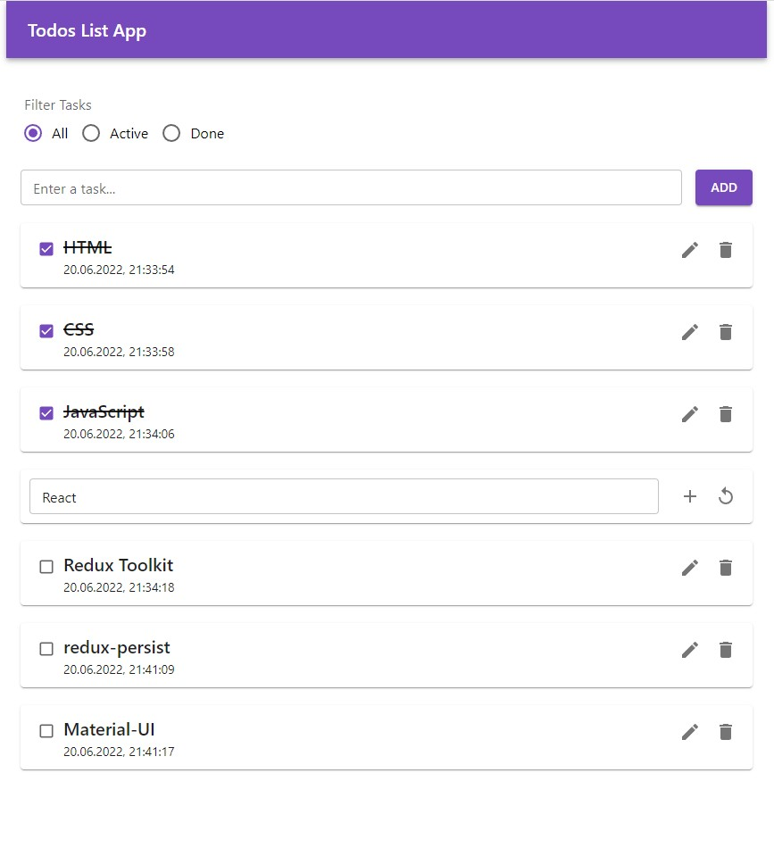

# Todos-List-React-Redux Portfolio Project
### мини приложение списка задач на React, с возможностью добавления новых задач, удаления, редактирования и отметки выполнения. 
- Для управления состоянием приложения использована библиотека Redux Toolkit https://redux-toolkit.js.org/
- Для стилизации использована библиотека Materialize https://materializecss.com/
- Для хранения данных в localStorage библиотека redux-persist https://www.npmjs.com/package/redux-persist

